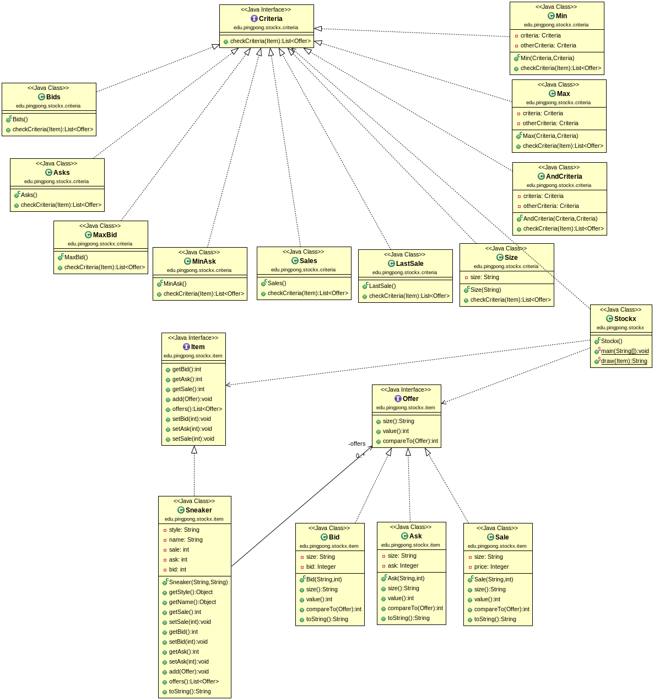

# StockX Java Kata

> In this repository you'll find **StockX Kata**. This Java test is to know wich one were our actual level in software developing applying techiques we have learned. Follow with coherence the OOP paradigm, make a correct TDD process and apply the SOLID Principles, develop a program from the itnerpretation of an UML diagram and following the user stories. 

## Table of Contents

1. [Motivation](#motivation)
1. [Used Technologies](#used-technologies)
1. [Reflections](#reflections)
1. [UML Diagram](#uml-diagram)
1. [License](#license)

---

## Motivation

One of my biggest motivation was to challenge myself. It was an enjoyable test for my teacher and for me too. I tried to show how capable I am and how much I learned in just a few months. I've pushed myyself as hard as I could. This one has been my first ever code technic practice and I've enjoyed and i learned so much from it. I know I'm not going to forget never the mistakes I've done and I'm going always to keep the tips and values I've learned from this test. I hope you'll enjoy it as much as me if you fancy to try it.

---

**[⬆ back to top](#table-of-contents)**

## Used Technologies

- Java
- Junit
- Maven
- Jacoco
- MarkDown
- Github

---

**[⬆ back to top](#table-of-contents)**

## Reflections

My point of view of this test is really good. I think had been the three hours that I've learned more since I've started. It helped me to deal with unpredicted situations that someone never expect and how to deal with the stress. Even knowing I've done some mistakes I could avoid easly, I've learned new things I'm going to keep. Never before I've done a test of coding and i was suprised of how good I was dealing with it. This kata is based in all principles, procedures, paradigms,... that our teacher has been teaching to us since we started, the most important and to keep in mind before try this test are:

* OOP 
* TDD 
* DDD
* SOLID Principles
    * Single Responsability 
    * Open Close 
    * Liskov Substitution 
    * Interface Segregation
    * Dependency Inversion

All publics test, to anyone that alredy know about the coding, Java and all the main points referenced before. I hope you'll enjoy as much as me and it will make you feel happiness when you get a overcome a new user story, anger when you'll get stuck and a clever amaze when you'll get to the answer by one of the ways you've never expected.

---

**[⬆ back to top](#table-of-contents)**

## UML Diagram

> This UML Diagram has been provided by https://github.com/dfleta
---

**[⬆ back to top](#table-of-contents)**

## License

MIT License

Copyright (c) 2020 AntoniPizarro and Pau Llinàs

Permission is hereby granted, free of charge, to any person obtaining a copy
of this software and associated documentation files (the "Software"), to deal
in the Software without restriction, including without limitation the rights
to use, copy, modify, merge, publish, distribute, sublicense, and/or sell
copies of the Software, and to permit persons to whom the Software is
furnished to do so, subject to the following conditions:

The above copyright notice and this permission notice shall be included in all
copies or substantial portions of the Software.

THE SOFTWARE IS PROVIDED "AS IS", WITHOUT WARRANTY OF ANY KIND, EXPRESS OR
IMPLIED, INCLUDING BUT NOT LIMITED TO THE WARRANTIES OF MERCHANTABILITY,
FITNESS FOR A PARTICULAR PURPOSE AND NONINFRINGEMENT. IN NO EVENT SHALL THE
AUTHORS OR COPYRIGHT HOLDERS BE LIABLE FOR ANY CLAIM, DAMAGES OR OTHER
LIABILITY, WHETHER IN AN ACTION OF CONTRACT, TORT OR OTHERWISE, ARISING FROM,
OUT OF OR IN CONNECTION WITH THE SOFTWARE OR THE USE OR OTHER DEALINGS IN THE
SOFTWARE.

---

**[⬆ back to top](#table-of-contents)**
